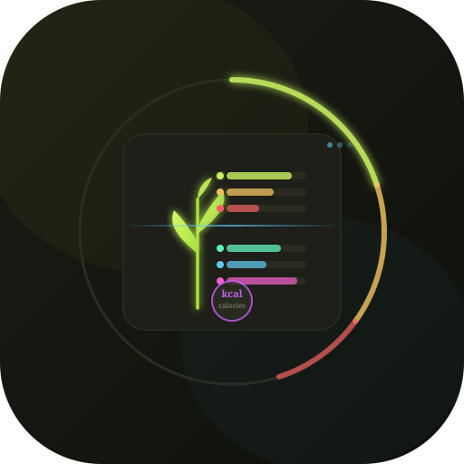

<div align="center">



# NutriScan
### *Eat Smart. Live Better.*

**AI-powered food nutrition explorer — instantly know what's inside every bite.**

[](https://YOUR-USERNAME.github.io/nutriscan)
[](https://pages.github.com)
[](https://anthropic.com)

</div>

---

## ✨ What is NutriScan?

NutriScan is a beautiful, AI-powered web app that gives you a **complete nutritional breakdown** of any food — instantly. Type any food, set your quantity in any unit, and get detailed data on:

- 💪 **Macronutrients** — Protein, Carbs, Fat, Fiber, Sugar, Sodium
- 🌟 **Vitamins** — A, B-complex, C, D, E, K and more with % Daily Value
- 💎 **Minerals** — Calcium, Iron, Potassium, Magnesium and more
- 📊 **Glycemic Index** — Low / Medium / High GI rating
- 🏷️ **Diet Tags** — Vegan, Keto, Gluten-Free, High-Protein, etc.
- 💡 **Health Insights** — Benefits, cooking tips, allergen warnings
- ✨ **Smart Tips** — Daily-life advice for each food

---

## 📸 Screenshot

> Search any food → set your quantity → get full nutrition instantly.

---

## 🚀 Quick Start

### Option 1 — Use it live
👉 **[Open NutriScan](https://YOUR-USERNAME.github.io/nutriscan)**

### Option 2 — Run locally
```bash
git clone https://github.com/YOUR-USERNAME/nutriscan.git
cd nutriscan
# Simply open index.html in your browser — no build step needed!
open index.html
```

---

## 📁 File Structure

```
nutriscan/
├── index.html          # Main app (single-file, no dependencies)
├── icon.svg            # App icon (SVG, works as favicon too)
├── README.md           # This file
├── _config.yml         # GitHub Pages config
└── .github/
    └── workflows/
        └── deploy.yml  # Auto-deploy to GitHub Pages on push
```

---

## 🌐 Deploy to GitHub Pages (3 steps)

1. **Fork or push** this repo to your GitHub account
2. Go to **Settings → Pages → Source → GitHub Actions**
3. Push any change — the app deploys automatically ✅

Your app will be live at:
```
https://YOUR-USERNAME.github.io/nutriscan
```

---

## 🔧 How It Works

NutriScan uses the **Anthropic Claude API** directly from the browser:

1. User enters a food + quantity
2. A structured prompt is sent to `claude-sonnet-4-20250514`
3. Claude returns precise nutrition data as JSON
4. The app renders it into beautiful, color-coded cards

No backend needed. No database. Just one HTML file.

---

## 📏 Supported Quantity Units

| Type | Units |
|------|-------|
| **Countable** | piece/item, slice, serving |
| **Volume** | cup, tablespoon, teaspoon, glass, bowl, scoop |
| **Weight** | gram, 100g, kilogram, ounce, pound |

---

## 🎨 Tech Stack

| Layer | Tech |
|-------|------|
| Frontend | Vanilla HTML + CSS + JavaScript |
| Fonts | Fraunces (serif) + DM Sans — Google Fonts |
| AI | Anthropic Claude API (claude-sonnet-4-20250514) |
| Hosting | GitHub Pages |
| Build | None — zero-dependency single file |

---

## 🤝 Contributing

Pull requests are welcome! Some ideas:
- 🌍 Multi-language support
- 📱 PWA / offline mode
- 🗂️ Food history / favourites
- 📊 Daily intake tracker
- 🍽️ Meal builder (add multiple foods)

---

## 📄 License

MIT License — free to use, modify and distribute.

---

<div align="center">

Made with ❤️ and **Claude AI**

*Eat Smart. Live Better.*

</div>
